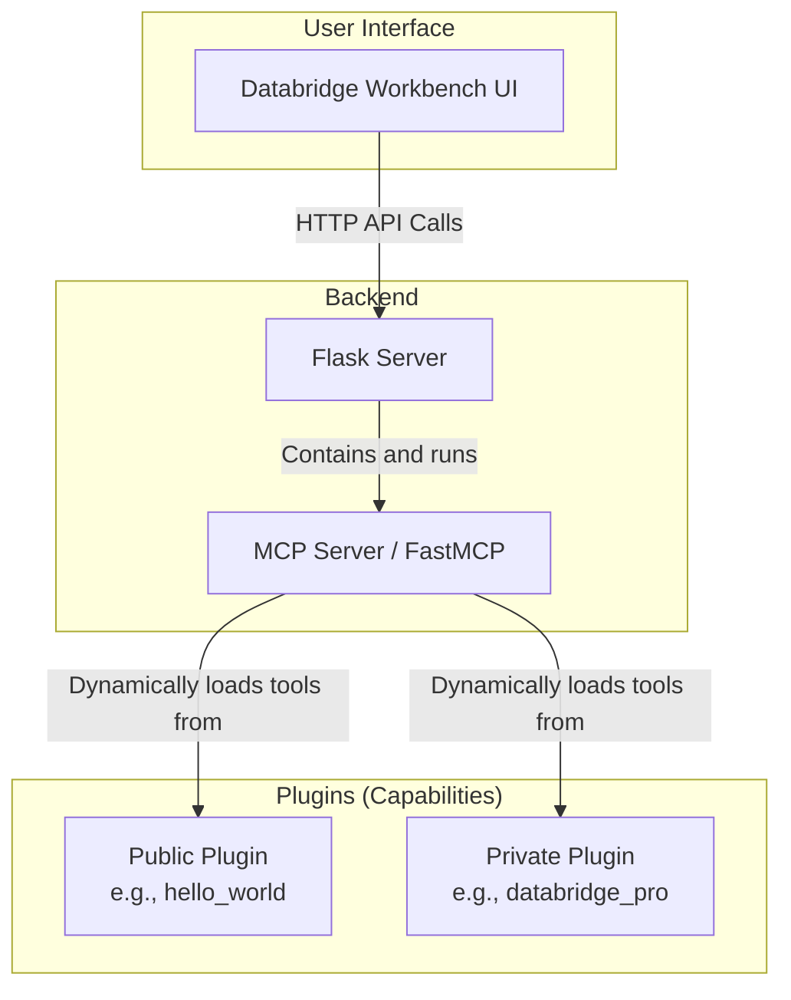

# Architecture Overview

The Databridge AI framework is designed with a clear separation between the user interface, the core server, and the tools that provide its capabilities. This modularity is key to the plugin-based architecture.

## Components

### 1. Databridge Workbench (UI)
- **Location:** `databridge-ce/ui/`
- **Technology:** A single-page application built with vanilla HTML, CSS, and JavaScript.
- **Role:** Provides the user-friendly, interactive interface for the entire system. It communicates with the backend via a standard REST API. It has no direct knowledge of the tools themselves; it discovers them by querying the backend API.

### 2. Flask Server
- **Location:** `databridge-ce/run_ui.py`
- **Technology:** Python (Flask).
- **Role:** Serves the HTML/CSS/JS for the Workbench UI and provides the API endpoints that the UI calls. It holds the central instance of the MCP Server.

### 3. MCP Server (FastMCP)
- **Location:** `databridge-ce/src/server.py`
- **Technology:** Python (`FastMCP`).
- **Role:** This is the heart of the framework. Its primary job is to discover, register, and manage all the available tools. It exposes a unified interface for executing tools, regardless of where they come from.

### 4. Plugins
- **Location:** `databridge-ce/plugins/` and `private_plugins/`
- **Technology:** Python.
- **Role:** Plugins are directories that contain a set of related tools. The MCP Server's **Plugin Loader** automatically discovers these directories at startup and calls their `register_tools` function to add their capabilities to the system. This is what makes the framework extensible. Your proprietary IP lives in the `private_plugins` directory, which is not part of the open-source repository, but its tools are loaded into the server all the same.